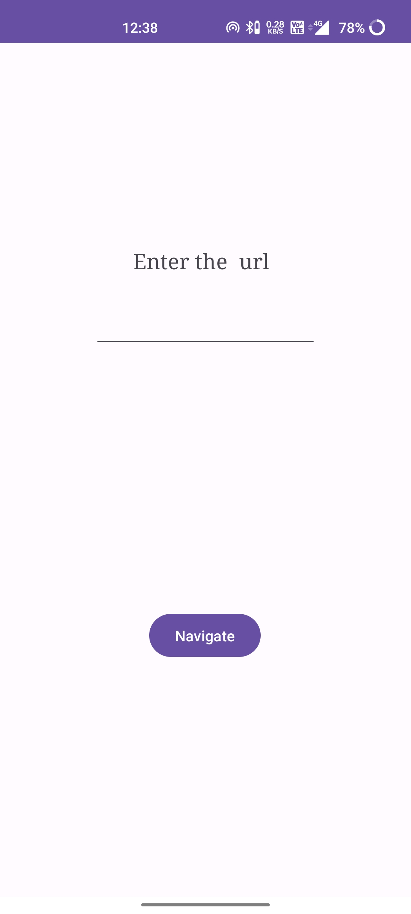
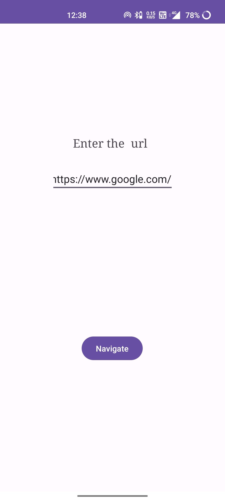
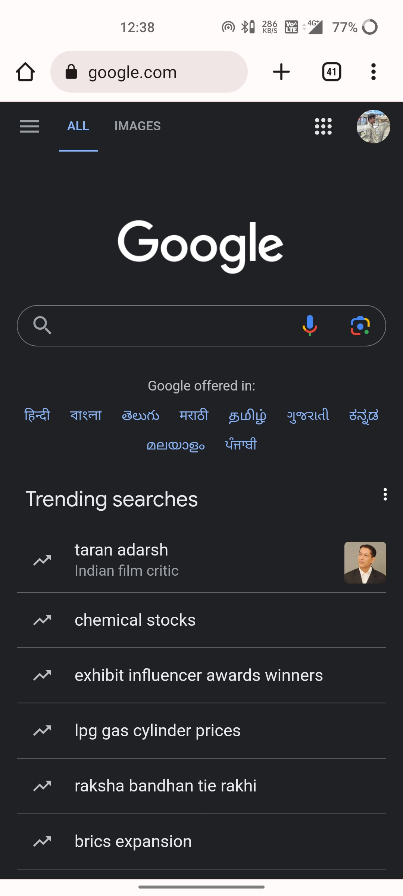

# Ex.No:3 Develop program to create a text field and a button “Navigate”. When you enter “www.google.com” and press navigate button it should open google page using Implicit Intents.


## AIM:

To create a navigate button using Implicit Intent to display the google page using Android Studio.

## EQUIPMENTS REQUIRED:

Latest Version Android Studio

## ALGORITHM:


## PROGRAM:
```
/*
Program to print the text “Implicitintent”.
Developed by: HARIHARAN E
Registeration Number : 212221040052
*/
```

activity_main.xml:

```
<?xml version="1.0" encoding="utf-8"?>
<androidx.constraintlayout.widget.ConstraintLayout xmlns:android="http://schemas.android.com/apk/res/android"
    xmlns:app="http://schemas.android.com/apk/res-auto"
    xmlns:tools="http://schemas.android.com/tools"
    android:layout_width="match_parent"
    android:layout_height="match_parent"
    tools:context=".MainActivity">

    <EditText
        android:id="@+id/editTextText"
        android:layout_width="wrap_content"
        android:layout_height="wrap_content"
        android:ems="10"
        android:inputType="text"
        app:layout_constraintBottom_toTopOf="@+id/button"
        app:layout_constraintEnd_toEndOf="parent"
        app:layout_constraintStart_toStartOf="parent"
        app:layout_constraintTop_toTopOf="parent" />

    <Button
        android:id="@+id/button"
        android:layout_width="wrap_content"
        android:layout_height="wrap_content"
        android:layout_marginBottom="220dp"
        android:text="Navigate"
        app:layout_constraintBottom_toBottomOf="parent"
        app:layout_constraintEnd_toEndOf="parent"
        app:layout_constraintHorizontal_bias="0.498"
        app:layout_constraintStart_toStartOf="parent" />

    <TextView
        android:id="@+id/textView"
        android:layout_width="wrap_content"
        android:layout_height="wrap_content"
        android:layout_marginBottom="26dp"
        android:fontFamily="serif"
        android:text="Enter the  url"
        android:textSize="20sp"
        app:layout_constraintBottom_toTopOf="@+id/editTextText"
        app:layout_constraintEnd_toEndOf="parent"
        app:layout_constraintHorizontal_bias="0.484"
        app:layout_constraintStart_toStartOf="parent"
        app:layout_constraintTop_toTopOf="parent"
        app:layout_constraintVertical_bias="1.0" />
</androidx.constraintlayout.widget.ConstraintLayout>
```

MainActivity.java:
```
package com.example.implicitindent;

import androidx.appcompat.app.AppCompatActivity;

import android.content.Intent;
import android.net.Uri;
import android.os.Bundle;
import android.view.View;
import android.widget.Button;
import android.widget.EditText;

public class MainActivity extends AppCompatActivity {

    @Override
    protected void onCreate(Bundle savedInstanceState) {
        super.onCreate(savedInstanceState);
        setContentView(R.layout.activity_main);
        Button button = findViewById(R.id.button);
        EditText editText =  findViewById(R.id.editTextText);

        button.setOnClickListener(new View.OnClickListener() {
            @Override
            public void onClick(View view) {
                String url=editText.getText().toString();
                Intent intent=new Intent(Intent.ACTION_VIEW, Uri.parse(url));
                startActivity(intent);
            }
        });
    }
}
```
## OUTPUT








## RESULT
Thus a Simple Android Application create a navigate button using Implicit Intent to display the google page using Android Studio is developed and executed successfully.


